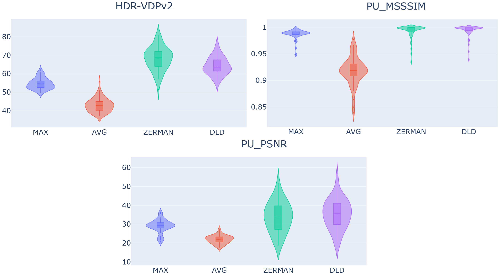
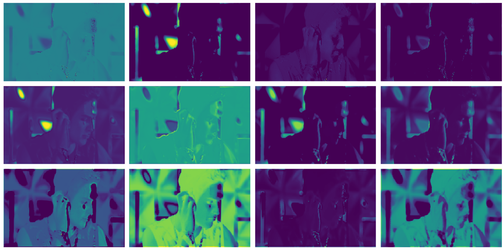
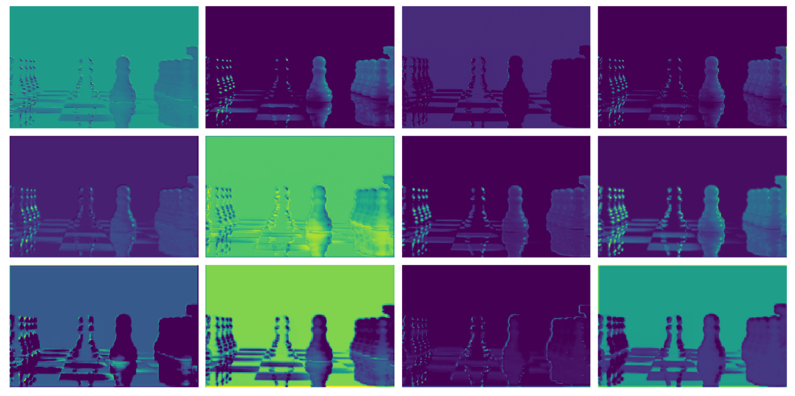

# DeepLocalDimming
В данном репозитории хранятся основные файлы, связанные с реализацией алгоритма из статьи [Duan et al.](https://arxiv.org/abs/2008.08352). 
## Имеются следующие основные файлы:
1. DeepLocalDimming_Zerman.ipynb – основной нотбук обучения
2. test_run_Zerman.ipynb – нотбук для прогона обученной модели на датасете
3. test_run0_Zerman_Fast-MAX_AVG_GD.ipynb – реализованные MAX, AVG и GD методы для Цермановского дисплея

## Вспомогательные:
1. hex_coords.json – координаты смещений от позиции каждого леда для подсчета MAX и AVG 
2. zerman_led_psf.csv – 2d(1025x1025) PSF Цермановского дисплея
3. Zermans_LEDS_POSITION_2202.json – позиции ледов относительно LCD для Цермановского дисплея
4. python_files/fft_conv – реализация свертки для большого ядра с помощью быстрого преобразования Фурье из https://github.com/fkodom/fft-conv-pytorch
5. python_files/HDRnew.py – исходная модель нейронной сети
6. python_files/HDRnewLarge0.py – увеличенная версия нейронной сети(ResNet34 вместо ResNet18 в энкодере)
7. python_files/HDRsmall.py – уменьшенная версия нейронной сети
8. python_files/pu21_encoder.py – Perception Uniform кодирование реализованное на python по (https://github.com/gfxdisp/pu21)

train и val содержать только два изображения для демонстрационного запуска:
полный набор использованного датасета можно скачать [здесь](https://drive.google.com/drive/folders/1ClFe0j3kKY7VPp4aVUH3SOETHztCkLcf?usp=sharing). Там же находится датасет, на котором проводились тесты. 

# Основные результаты на тестовом датасете

